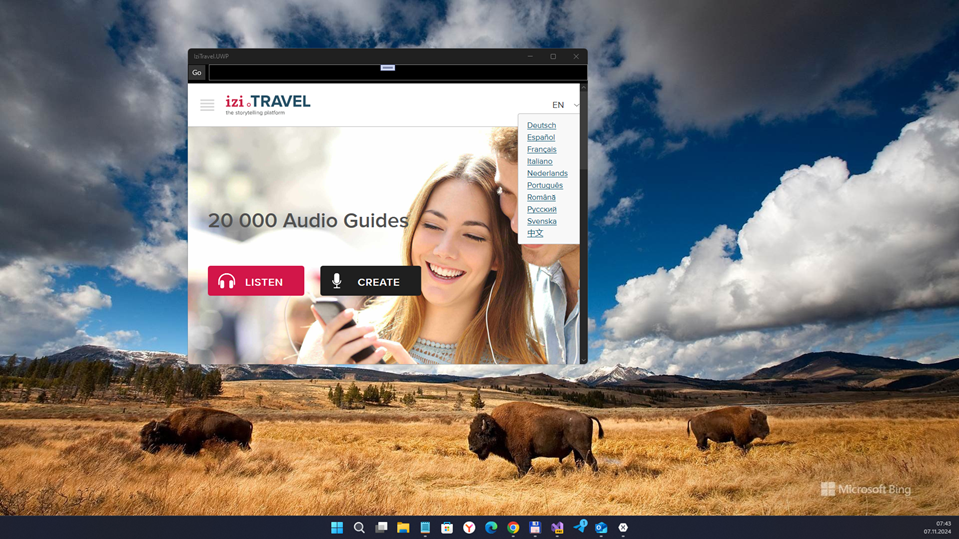

# IziTravel v8.0.1 (alpha)

My attempt to "recover" (pseudo-upgrade via quick/fast "PWA" dev) discontinued Izi.Travel for WindowsMobile 8. My mini-goal is only PWA-like simplest "UWP"... no less, no more :) However, full R.E./RnD is also good idea!

## About
I noticed that IziTravel "deal makers" decided to erase/delete IziTravel project from Microsoft Store. Also, I explored xap package file and notices: the code is not UWP-compatible, it's obsolete WM8 code.
So, I created the simplest "pseudo-PWA" app to display IziTravel web site on "winphone" with Windows 10 Mobile.

## Screenshots

## Tech/dev details
- Platforms: UWP
- Targets: x86 / x64 / ARM
- OS: Windows 10/11, Windows 10 Mobile
- Min. Win. os build: 10240 (Hello, Project Astoria!)

## Unsolved big problems
- R.E. of old izi.Travel not realized yet & original src code not found (izi.Travel support issues/delays) 
- Very poor https://izi.travel compatibility with non-Android platforms/browsers (egde, firefox, etc.) 

## Reference(s)
- [Izi.Travel](https://izi.travel)  Izi.Travel web site

## Licensing
MIT License

## ..
AS IS. No support. RnD only / DIY

## .
[m][e] 2024
